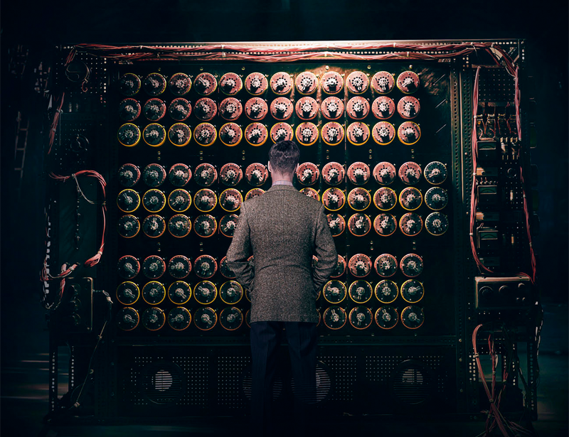

<p align="center">

</p>

_"Machines can never think as humans do but just because something thinks differently from you, does it mean it's not thinking?"_ The Imitation Game.

This kernel uses TMDb (The Movie Database) 5000 Movie dataset to build a content-based recommendation engine using plots and metadata. Modern recommendation systems use votes and likes by the user, but perhaps for a plane new user this approach can come in handly.

The dataset is nicely organized and pretty clean, it consists of two files, one with movie information like budget, revenue, user´s votes, etc. And a second that list cast and crew, which can be join by the movie_id column. First i do some exploration to find some cool facts about top actors, directors and get some visualizations. Then i go through three approach to build a recommendation system. Finally(in Progress) i try to use a LDA (Latent Dirichlet Allocation) topic model as a reduction technique to see if i can get similar results as previous.

# Loading libraries & inspecting datsets

I do heavily use on `tydiverse` universe. `tm` and `tidytext` for text manipulation and  `topicmodels` for LDA. Also, because it comes perfect for the kernel, all visualization have `wesanderson` color palettes

```{r init, message=FALSE, warning=FALSE}
library(jsonlite)
library(tidyverse)
library(magrittr)
library(tm)
library(tidytext)
library(topicmodels)
library(wesanderson)
library(GGally)

movies_db <- read_csv("tmdb-5000-movie-dataset/tmdb_5000_movies.csv")

credits_db <- read_csv("tmdb-5000-movie-dataset/tmdb_5000_credits.csv")

glimpse(movies_db)

```

It can be seen there are some columns in JSON format like genres and production_companies, the same happens with crew and cast in the credits_db. In every cell of theese columns there are several values. e.g genres can have two values for one movie but four for other. Lets create some dataframe out of those columns, keeping movie_id to join later on. The code for this task comes from this [kernel](https://www.kaggle.com/epfreed/tidydata-movie-dataset-exploration/report)

```{r prep}
genres <- movies_db %>%
        filter(nchar(genres) > 2) %>%
        mutate(aux_json = lapply(genres, fromJSON)) %>%
        unnest(aux_json) %>%
        select(id, genres = name) %>%
        mutate_if(is.character, factor)

prod_comp <- movies_db %>%
        filter(nchar(production_companies) > 2) %>%
        mutate(aux_json = lapply(production_companies, fromJSON)) %>%
        unnest(aux_json) %>%
        select(id, production_companies = name) %>%
        mutate_if(is.character, factor)

cast <- credits_db %>% 
  filter(nchar(cast) > 2) %>% 
  mutate(aux_json = lapply(cast, fromJSON)) %>% 
  unnest(aux_json) %>% 
  filter(order < 5) %>% 
  select(movie_id, name)
  
director <- credits_db %>% 
  filter(nchar(crew) > 2) %>% 
  mutate(aux_json = lapply(crew, fromJSON)) %>% 
  unnest(aux_json) %>% 
  filter(department == 'Directing' & job == 'Director') %>% 
  select(movie_id, name)

head(genres)
```


# Exploring data

Lets use ggpairs function of `GGally` package to inspect correlation and distribution of some variables

```{r ggpair, message=FALSE, warning=FALSE}

lowerFn <- function(data, mapping, method = "lm") {
  ggplot(data = data, mapping = mapping) +
    geom_point(colour = "slategray4", size = 2, shape = 18) +
    geom_smooth(method = method, color = "coral3") +
    theme_minimal() +
    theme(axis.text.x = element_text(size = 8, angle = 45))
}

movies_db %>% 
  select(budget, revenue, release_date, vote_average, vote_count, runtime) %>%
  na.omit() %>% 
  ggpairs(lower = list(continuous = wrap(lowerFn, method = "lm")),
    diag = list(continuous = wrap("barDiag", fill = 'skyblue1', colour = "skyblue4")),
    upper = list(continuous = wrap("cor", size = 5)),
    progress = FALSE)

```

* We see some variables that are skew like budget and revenue that also have the strongest positive correlation. 

* The dataset consist of movies mainly released after 1960, we also see a big jump in the number of movies released after the 90.

* Vote average is dense around 6, with a little concentration in 0, probably those are expected movies with big production that dind´t like. Vote count is also skew.

* Runtime is dense around 100 minutes 

## Top Directors & Actors

From df genres lets take the first genre of every movie assuming is the most representative and join with director df to get the top directors by number of movies, filling the bar with the genre of every movie

```{r top_directors}

# Keep only the first genre
genre_1 <- genres %>% group_by(id) %>% summarise(genre = first(genres))

# Identify top directors by num of movies
top_directors <- director %>% 
  group_by(name) %>%
  summarise(total_n = n()) %>% 
  top_n(20, wt = total_n)

director %>% 
  filter(name %in% top_directors$name) %>% 
  left_join(genre_1, by = c('movie_id' = 'id')) %>% 
  count(name, genre) %>% 
  left_join(top_directors, by = 'name') %>% 
  ggplot(aes(x = reorder(name, total_n), y = n, fill = genre)) +
  geom_col() + 
  coord_flip() +
  scale_fill_manual(values = wes_palette('Darjeeling1', length(unique(genre_1$genre)), type = 'continuous')) +
  labs(x = 'Directors', y = 'Number of Movies')

```

We see genres that prevail in the top20 directors are action, drama, and comedy. Lets do the same with actors

```{r top_actors}

# Identify top actors by number of movies
top_actors <- cast %>% 
  group_by(name) %>%
  summarise(total_n = n()) %>% 
  top_n(20, wt = total_n)

cast %>% 
  filter(name %in% top_actors$name) %>% 
  left_join(genre_1, by = c('movie_id' = 'id')) %>% 
  count(name, genre) %>% 
  left_join(top_actors, by = 'name') %>%
  ggplot(aes(x = reorder(name, total_n), y = n, fill = genre)) +
  geom_col() + 
  coord_flip() +
  scale_fill_manual(values = wes_palette('Darjeeling1', length(unique(genre_1$genre)), type = 'continuous')) +
  labs(x = 'Actors', y = 'Number of Movies')

```

Lets look now the directors-actors colaborations with total revenues

```{r colaborations}

# Join director, cast and revenue dfs
director %>% 
  left_join(cast, by = 'movie_id') %>%
  left_join(movies_db %>% select(id, revenue), by = c('movie_id' = 'id')) %>% 
  transmute(director = name.x, actor = name.y, revenue,
            colaboration = paste(director, actor, sep = '-')) %>% 
  filter(director != actor) %>% 
  group_by(colaboration) %>% 
  summarise(n = n(), revenue = sum(revenue)) %>% 
  top_n(15, wt = n) %>% 
  ggplot(aes(x = reorder(colaboration, revenue), y = n)) +
  geom_col(fill = wes_palette('Royal1', 1, type = 'discrete')) + 
  coord_flip() +
  geom_text(aes(label = paste(round(revenue/1000000,1), 'M')), y = 0.5, size = 3, 
            colour = wes_palette('Darjeeling2', 1, type = 'discrete')) +
  labs(x = 'Top Colaborations', y = 'Number of Movies')
  
```

## Top Movies

What about the best movies according to this dataset?. First lets see in more detail the distribution of votes 

```{r votes_dist}

movies_db %>%
  select(vote_average, vote_count) %>% 
  summary()

```

Lets filter the top 50% of vote counts, that is 235 votes and plot the top 20 movies by vote avg

```{r vote_movies}
movies_db %>% 
  filter(vote_count > 235) %>%
  select(id, title, vote_average) %>%
  left_join(genre_1, by = 'id') %>%
  top_n(20, wt = vote_average) %>% 
  ggplot(aes(x = reorder(title, vote_average), y = vote_average, fill = genre)) +
  geom_col() + 
  coord_flip() +
  scale_fill_manual(values = wes_palette('Rushmore', 6, type = 'continuous')) +
  labs(x = 'Movies', y = 'Vote Avg')
```

We see here that most of the movies are drama, though i wouldnt label 'Psycho' as drama since it´s a cult horror movie, or 'American History X' which i consider more like a crime movie, but that´s quite subjective. It looks like genre is prevailing by drama, lets look at it considering one movie could have several genres

```{r top_genres}
genres %>% 
  count(genres) %>% 
  ggplot(aes(x = reorder(genres, n), y = n)) +
  geom_col(fill = wes_palette('Zissou1', 1, type = 'discrete')) +
  coord_flip() +
  labs(x = 'Genres', y = 'Number of Movies')
```

## Production Companies

Lets look for Production Companies. One movie could have several production companies, lets assume they split budget and revenue equally which is obviously not true, but could give a sense of the size of the company. The number inside the columns are mean budget

```{r top_prod}

# Get number of movies by prod companies
prod_comp_n <- prod_comp %>%
  count(id)

prod_comp %>% 
  left_join(movies_db %>% select(id, budget), by = 'id') %>% 
  left_join(prod_comp_n, by = 'id') %>%
  transmute(production_companies, budget = budget/n) %>% 
  group_by(production_companies) %>% 
  summarise(n = n(), budget = mean(budget)) %>%
  top_n(20, wt = n) %>% 
  ggplot(aes(x = reorder(production_companies, n), y = n)) +
  geom_col(fill = wes_palette('Royal1', 1, type = 'discrete')) + 
  coord_flip() +
  geom_text(aes(label = paste(round(budget/1000000,1), 'M')), y = 20, size = 3, 
            colour = wes_palette('Darjeeling2', 1, type = 'discrete')) +
  labs(x = 'Prod Company', y = 'Number of Movies')

```

Lets look for mean profit with this assumption, i use plotly in this one since it gives labels interaction. I filter companies that have more than 5 movies

```{r profit, message=FALSE, warning=FALSE}

prod_comp %>% 
  left_join(movies_db %>% select(id, budget, revenue), by = 'id') %>% 
  left_join(prod_comp_n, by = 'id') %>%
  transmute(production_companies, budget = budget/n, revenue = revenue/n, profit = revenue-budget) %>% 
  group_by(production_companies) %>% 
  summarise(n = n(), budget = mean(budget), revenue = mean(revenue), profit = mean(profit)) %>%
  filter(budget != 0, n > 5) %>%
  plotly::plot_ly(x = ~profit, y = ~budget, color = ~n, type = 'scatter',
                  mode = 'markers', text = ~production_companies, size = ~n,
                  colors = (c(wes_palette('Zissou1', 2, type = 'continuous'))))

```

# System Recommendation

## Based on Metadata

Lets check for na and duplicated names

```{r}
 movies_db %>% select(title) %>% is.na() %>% which()

 movies_db %>% select(title) %>% duplicated() %>% which()
```

Since there are just three obs with duplicated names lets just remove it.

The first approach uses genres, director and actors to recommend movies. First i remove spaces between words and paste all in one df to form the corpus which is the object that requeries tm. Then we pass the function to calculate frecuencies, in this case we will use binary weight, since an actor, director or genre can only appear once

```{r system_metadata}

# group labels
pasted_genres <- genres %>% 
  mutate(genres = str_replace_all(genres, ' ', '')) %>% 
  group_by(id) %>% 
  summarise(genres = paste(genres, collapse = ' ' ))

pasted_directors <- director %>% 
  mutate(director = str_replace_all(name, ' ', '')) %>% 
  group_by(movie_id) %>% 
  summarise(director = first(director))

pasted_cast <- cast %>%
  mutate(actors = str_replace_all(name, ' ', '')) %>% 
  group_by(movie_id) %>% 
  summarise(actors = paste(actors, collapse = ' ' ))

# Create corpus
corpus_metadata <- movies_db %>%
  select(id, title) %>% 
  distinct(title, .keep_all = TRUE) %>% 
  left_join(pasted_genres, by = 'id') %>% 
  left_join(pasted_directors, by = c('id' = 'movie_id')) %>% 
  left_join(pasted_cast, by = c('id' = 'movie_id')) %>% 
  transmute(doc_id = title, text = paste(genres, director, actors)) %>% 
  as.data.frame() %>% 
  DataframeSource() %>%
  Corpus()

# Form dtm with binary weighting
dt_md_bin <- DocumentTermMatrix(corpus_metadata,
                        control = list(weighting = function(x) weightBin(x)))

# Convert into Matrix
frec_matrix <- dt_md_bin %>% as.matrix()

frec_matrix[1:5, 1:5]

```

Lets create a function that receive a title and returns recommendation. The function compares the terms of the input title with all the matrix, paste the votes of the movie and return the ones that match more terms and have more votes. Lets see recommendations for Titanic

```{r recommender_function}
recommender <- function(matr, title = 'Avatar', db = movies_db, n = 10){
  
  # matr: matrix of weigth
  # title: string title of the movie
  # db: original df to extract votes
  # n: number of recommendations to provide
  
  ind <- which(row.names(matr) == title)
  
  frec_movie <- matr[ind,]
  
  # Sum vector and matrix to identify mutual terms
  mutual_terms <- sweep(matr, 2, frec_movie, '+')

  # Sum mutual terms
  most_frec <- apply(mutual_terms, 1, function(x) {sum(x == 2)})

  # Join with original df to get vote_average
  recomms <- data.frame(title = names(most_frec), frec = most_frec) %>% 
    mutate_if(is.character, factor) %>% 
    left_join(db %>%
                select(title, vote_average) %>% 
                distinct(title, .keep_all = TRUE) %>% 
                mutate_if(is.character, factor), 
              by = 'title') %>% 
    arrange(desc(frec), desc(vote_average)) %>% 
    select(title) %>% 
    head(n)
  
  return(recomms)
}

recommender(frec_matrix, 'Titanic')
```

I leave the same movie as recommendations to know that the function is working properly. We see that for Titanic we receive movies mainly performer by Leonardo DiCaprio or Kate Winslet, in fact the first recommendation is a romantic drama starred by both.

## Based on Plot

Lets now use the plot of the movie as a recommendation. Now plots are longer text than just names and labels of genres, so we need to pre process the corpus:

* Remove puntuation and numbers.

* Remove stopwords, theese are common words that do not provide real meaning to identify the plot, e.g words like the, is, at, which, on, etc.

* Stem the words, which consist in using the root of the word to group them with same meaning but in different tense. e.g working, worked, works will now convert to work

All this can be done easily with the `tm` package, though normaly the pre process in text minning requires more attention, like choosing appropiate dictionaries and looking deeply into the corpus structure. 

Other difference is that we now use a [Tf-Ifd](https://en.wikipedia.org/wiki/Tf%E2%80%93idf) (Term frequency-Inverse document frequency) weigth which consist in the basic frequency of term in document but is offset by the number of documents in the corpus that contain the word, this helps to adjust the words that appear frequently in the corpus and general meaning doesn´t help to identify groups. This [bolg](https://www.onely.com/blog/what-is-tf-idf/) gives more insights about Tf-Idf

```{r system_plot}

# Create corpus
corpus_plot <- movies_db %>%
  select(title, overview) %>% 
  distinct(title, .keep_all = TRUE) %>% 
  na.omit() %>% 
  transmute(doc_id = title, text = overview) %>% 
  as.data.frame() %>% 
  DataframeSource() %>%
  Corpus() %>% 
  tm_map(removePunctuation) %>%
  tm_map(removeNumbers) %>% 
  tm_map(content_transformer(tolower)) %>%
  tm_map(removeWords, stopwords("SMART")) %>%
  tm_map(stripWhitespace) %>% 
  tm_map(stemDocument)
 
# Form dtm with Tf-Idf weighting
dt_plot_tfidf <- corpus_plot %>% 
  DocumentTermMatrix(control = list(weighting = function(x) weightTfIdf(x))) 

tfidf_matrix <- dt_plot_tfidf %>% as.matrix()

tfidf_matrix[1:5, 1:5]

```

Now we need a function to get the recommendations but the one we already did only works with binary weights, so we create a new one that calculates the [cosine similarity](https://en.wikipedia.org/wiki/Cosine_similarity) between the weights of the movie input and the rest of the matrix. A nice explanation of cosine similarity can be found [here](https://towardsdatascience.com/introduction-to-text-representation-and-similarity-b5dd3fd71737)

```{r cosine_function, message=FALSE, warning=FALSE}

#function by: https://codereview.stackexchange.com/questions/159396/cosine-similarity-of-one-vector-with-many response
cosineSim <- function(x, m){
  y = x / sqrt(crossprod(x));
  return(as.vector((m %*% y) / sqrt(rowSums(m^2))) );
}

recommender_cosine <- function(matr, title = 'Avatar', n = 10){
  
  # matr: matrix of weigth
  # title: string title of the movie
  # n: number of recommendations to provide
  
  ind <- which(row.names(matr) == title)
    
  t <- matr[ind,] %>% as.numeric()
  
  cosine_dist_mat <- cosineSim(t, matr)
  
  term_dist <- data.frame(title = row.names(matr), distance = cosine_dist_mat) 

  recommendations <- term_dist %>% 
    arrange(desc(distance)) %>% 
    head(n)

  return(recommendations)
}

recommender_cosine(tfidf_matrix, 'Titanic')
```

We se for Titanic some recommendations about other ships movies like 'Rise the Titanic', 'Ghost Ship' and 'The Chambermaid on the Titanic'. It also appears movies which includes the word 'rose' like 'The Rose' and 'The Ballad of Jack and Rose', in fact 'Niagara' main character is called Rose, so is matching the names characters with the one of Kate Winslet character. Lets see the words that appears in the 'Titanic' plot

```{r corpus_plot_example, message=FALSE, warning=FALSE}
corpus_plot[['Titanic']]$content
```

We see the word april, thats probably why one recommendations is 'Pieces of April', another fact is that stemming the words produces the word titanic be replaced by titan, and thats why we see 'Wrath of the Titans' which has nothing in common with Titanic. Obviously i need to focus in a better pre-process as we said previously.

## Combined system

Finally lets try a combined system but as we saw better results with metadata, we will put more weigth in director and actors. This system will use a Tf (Term frequency) weight since it doesn´t make much sense to offset actors, directors or genres

```{r system_combined, message=FALSE, warning=FALSE}

corpus_combined <- movies_db %>%
  select(id, title, overview) %>% 
  distinct(title, .keep_all = TRUE) %>% 
  left_join(pasted_genres, by = 'id') %>% 
  left_join(pasted_directors, by = c('id' = 'movie_id')) %>% 
  left_join(pasted_cast, by = c('id' = 'movie_id')) %>% 
  transmute(doc_id = title, text = paste(genres, director, director, actors, actors, overview)) %>% 
  as.data.frame() %>% 
  DataframeSource() %>%
  Corpus() %>% 
  tm_map(removePunctuation) %>%
  tm_map(removeNumbers) %>% 
  tm_map(content_transformer(tolower)) %>%
  tm_map(removeWords, stopwords("SMART")) %>%
  tm_map(stripWhitespace) %>% 
  tm_map(stemDocument)

dt_combined_tf <- corpus_combined %>% 
  DocumentTermMatrix(control = list(weighting = function(x) weightTf(x)))

tf_combined_matrix <- dt_combined_tf %>% as.matrix()

recommender_cosine(tf_combined_matrix, 'Titanic')

```

We see that it achieve a combination of both system, lets make a function in order to compare the systems

```{r comparation, message=FALSE, warning=FALSE}

compare_engines <- function(.title = 'Avatar'){
  
  syst_1 <- recommender(frec_matrix, title = .title)
  syst_2 <- recommender_cosine(tfidf_matrix, title = .title) %>% select(title)
  syst_3 <- recommender_cosine(tf_combined_matrix, title = .title) %>% select(title)
  
  df <- cbind(syst_1, syst_2, syst_3) %>% setNames(c('metadata', 'plot', 'combined'))
  
  return(df)
}

compare_engines('Fight Club')

```


```{r comp_example, message=FALSE, warning=FALSE}
compare_engines('Memento')
```

After some play around i think the engines work with some limitation specially the one that only uses plot. The combined works pretty well consider it gives similar recommendations as the metadata-based that uses vote average

# LDA model

The last part of the kernel consist in apply LDA (Latent Dirichlet Allocation) as a reduction method and see if we can have similar results as previous.

[LDA](https://es.wikipedia.org/wiki/Latent_Dirichlet_Allocation) is a probabilistic model that allow observations to be explain by unobserved groups. It basically categorized documents in topics while this topics are formed by words. The cool fact about LDA is that it let the document to be formed by several topics as well that words can contribute to more than one topic. The downside is that it needs to set parameters from the beginning like alpha, beta and the number of topics to use, that are hard to set.
A really nice explanation can be found [here](https://medium.com/@lettier/how-does-lda-work-ill-explain-using-emoji-108abf40fa7d)

```{r lda_model, message=FALSE, warning=FALSE}

dt_plot_tf <- corpus_plot %>% 
  DocumentTermMatrix(control = list(weighting = function(x) weightTf(x))) 


lda_tf <- LDA(dt_plot_tf, k = 5, 
           control = list(estimate.alpha = FALSE, alpha = 5, 
                          seed = 1234))

# code by: https://www.tidytextmining.com/topicmodeling.html
tidy(lda_tf, matrix = "beta") %>%
  group_by(topic) %>%
  top_n(10, beta) %>%
  ungroup() %>%
  arrange(topic, -beta) %>%
  mutate(term = reorder(term, beta)) %>%
  ggplot(aes(term, beta, fill = factor(topic))) +
  geom_col(show.legend = FALSE) +
  facet_wrap(~topic, scales = "free") +
  coord_flip() +
  scale_fill_manual(values = wes_palette('Moonrise2', 5, type = 'continuous'))

```

Above are the main words that represent each topic, we can see it´s difficult to match a topic with a genre, we probably need to focus on the pre-process like group synonyms and remove words with poorly contribution. Either way lets see the recommendations

```{r lda_recommender, message=FALSE, warning=FALSE}
lda_documents <- tidy(lda_tf, matrix = "gamma")

df <- lda_documents %>% 
  spread(topic, gamma) 

tmatrix <- as.matrix(df[,-1])
rownames(tmatrix) <- df$document

recommender_cosine(tmatrix, 'Titanic')
```

As expected the model provide meaningless recommendation, hopefully i would do an update with better results.

Thanks for reading my first kernel, i hope you found it useful!